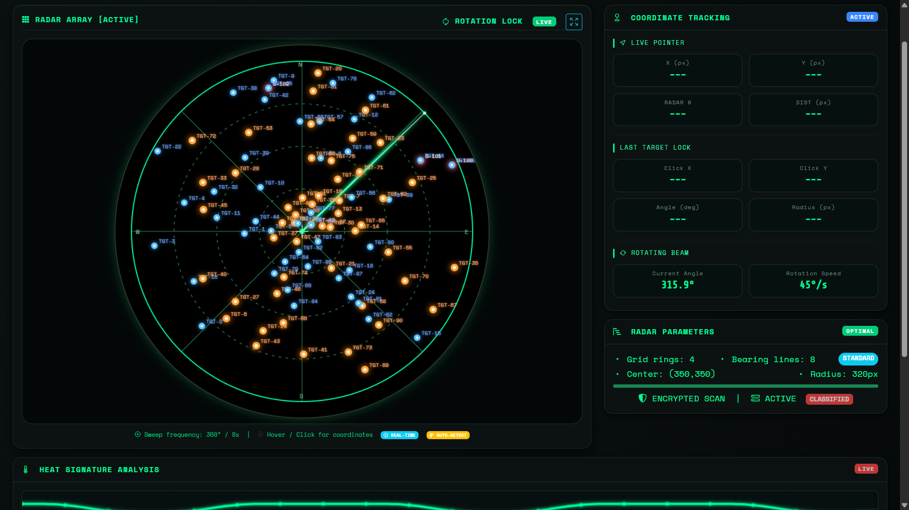

# MILI Radar System

**Multi-Purpose Radar Monitoring System**

## Overview

MILI Radar System is a sophisticated radar monitoring platform that simulates and analyzes radar data for various applications including:

- Automotive ADAS (Assistance Systems)
- Mining and Construction Site Monitoring
- WiFi Network Scanning
- Micro-Doppler Signature Analysis
- Network Packet Analysis & Firewall Protection

## Features

### Core Capabilities

- **Real-time Radar Visualization** - Interactive radar display with sweep animation
- **Multi-Mode Operation** - Circular, sector, and tracking scan modes
- **Heat Signature Analysis** - Visual representation of radar intensity
- **Coordinate Tracking** - Precise target positioning and tracking

### Automotive ADAS

- Adaptive Cruise Control simulation
- Automatic Emergency Braking
- Blind Spot Detection

### Mining & Construction

- Slope stability monitoring
- Vehicle collision detection
- Site visualization and alerts

### Network Security

- WiFi network scanning and analysis
- Packet sniffing and traffic analysis
- Firewall rule management
- Intrusion detection

## Quick Start

### Prerequisites

- **Python 3.8 or higher** - Core runtime environment
- **pip package manager** - Dependency management
- **Git (optional)** - Version control for cloning repository

### Installation

1. **Clone the repository**

        bash
        git clone https://github.com/8934528/radar.git
        cd radar

### 2. Setup and Run

#### **Option 1: Using Makefile (Recommended)**

        bash
        # Complete setup (creates venv, installs deps, runs server)
        make all

        # Or step by step
        make setup    # Create virtual environment and install dependencies
        make run      # Start the radar system

#### **Option 2: Manual Setup (Alternative)**

        bash
        # Navigate to backend directory
        cd radar/backend

        # Create virtual environment
        python -m venv venv

        # Activate virtual environment
                # On Windows:
                venv/Scripts/activate
                
                # On Linux/Mac:
                source venv/bin/activate

        # Install dependencies
        pip install -r requirements.txt

        # Run the application
        python main.py

3. Access the Interface
Once the server is running, open your browser and navigate to:

        text
        http://localhost:5000

## Make Commands

| Command      | Description                                      |
|--------------|--------------------------------------------------|
| `make all`   | Complete setup and run                           |
| `make setup` | Create virtual environment & install dependencies|
| `make run`   | Start the radar system                           |
| `make clean` | Remove virtual environment and cache files       |
| `make check` | Verify Python version and environment            |
| `make info`  | Show virtual environment information             |
| `make dev`   | Setup development environment                    |

## Project Structure

        radar/
        ├── backend/                      # Server
        │   ├── automotive_adas.py        # ADAS system implementation
        │   ├── firewall.py               # Firewall management
        │   ├── main.py                   # Flask server entry point
        │   ├── micro_doppler.py          # Doppler analysis
        │   ├── mining_construction.py    # Site monitoring
        │   ├── packet_sniffer.py         # Network packet capture
        │   ├── radar_system.py           # Core radar logic
        │   ├── scanning_modes.py         # Scan pattern control
        │   ├── wifi_scanner.py           # WiFi network scanning
        │   └── requirements.txt          # Python dependencies
        ├── frontend/                     # System interface
        │   ├── rador.html                # Dashboard
        │   ├── rador.css                 # Styling
        │   └── rador.js                  # Functionality
        ├── assets/                       # Images
        ├── Makefile                      # Build automation
        ├── LICENSE
        └── README.md

## Technology Stack

### Backend

### Frontend

## Configuration

### Radar Parameters

- Frequency: 24 GHz (adjustable)
- Power: 10 W
- Antenna Gain: 20 dB
- Scan Speed: 15-90 °/s

### Firewall Rules

Default rules allow:

- HTTP (80), HTTPS (443), DNS (53)
- Block Telnet (23) and RDP (3389)

## Usage Guide

### Radar Interface

1. Mode Selection: Choose between ADAS, Mining, or WiFi modes
2. Settings: Adjust scan speed, grid lines, and display options
3. Heat Signature: Monitor radar intensity levels
4. Coordinate Tracking: Hover/click for precise coordinates

### Network Monitoring

- Start packet capture with make run (requires admin/sudo)
- Monitor blocked packets and firewall alerts
- Analyze WiFi networks and signal quality

## Contributing

Contributions are welcome! Please feel free to submit a Pull Request.

1. Fork the repository
2. Create your feature branch *(git checkout -b feature/AmazingFeature)*
3. Commit your changes *(git commit -m 'Add some AmazingFeature')*
4. Push to the branch *(git push origin feature/AmazingFeature)*
5. Open a Pull Request

## License

This project is licensed under the MIT License - see the **LICENSE** file for details.

## Acknowledgments

- Inspired by modern radar systems and security monitoring platforms
- Built with Flask and modern web technologies
- Special thanks to all contributors

 Mili is Proudly Made by Mihlali Mabovula
Report Bug · Request Feature

